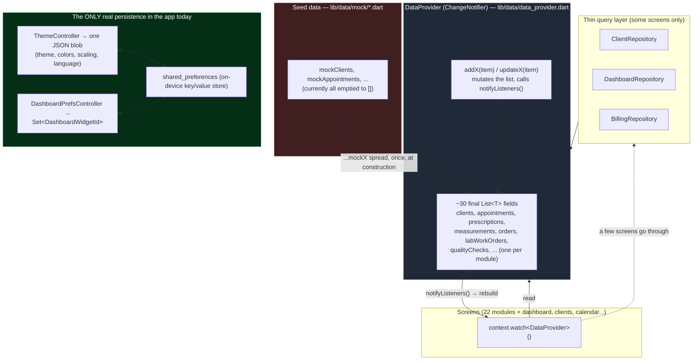

## Doc CRM — Firebase Migration Guide

Prepared for: single-shop deployment, synced across multiple devices (phone, tablet, front-desk PC) for the same business.

## Part 1 — The Current Caching System (As-Is)

This is what the app actually does today, based on the code — not an aspirational description.

### The short version

There is no cache. There is no database. Every piece of business data (clients, appointments, prescriptions, orders, everything across the 22 modules) lives in a single Dart object, in RAM, for the lifetime of the running app process. Close the app or reload the page, and it's gone — the app re-seeds itself from the (currently empty) mock data files. The only thing that survives a restart today is UI preferences (theme, language, which dashboard widgets are shown), and that's saved through a completely separate, much simpler mechanism.

### Diagram



### What each piece actually is

**`DataProvider`** (`lib/data/data_provider.dart`) is a single `ChangeNotifier` holding one `final List<T>` per module — `clients`, `appointments`, `prescriptions`, `measurements`, `frames`, `lenses`, `quotes`, `orders`, `labWorkOrders`, `mountingJobs`, `qualityChecks`, and so on, roughly 30 lists in total. It's registered once, at the very top of the widget tree, via `MultiProvider` in `main.dart`, so every routed screen can reach it.

**Reads.** Most of the 22 module screens call `context.watch<DataProvider>()` directly and read a list straight off it (e.g. `dataProvider.qualityChecks`). A handful of screens — Clients, Dashboard, Billing — go through a thin abstract interface (`ClientRepository`, `DashboardRepository`, `BillingRepository`) instead of touching `DataProvider` directly. Functionally these repositories do the exact same in-memory read today; the interface exists specifically so a real backend can be swapped in underneath without those three screens needing to change. That's a deliberate seam, and it's good news for the migration below.

**Writes.** Every "Add X" form ultimately calls `dataProvider.addX(item)`, which appends to the relevant list and calls `notifyListeners()`. Every listening widget (`context.watch<DataProvider>()`) rebuilds on the next frame. "Edit" flows call `updateX(item)`, which finds the record by `id` and replaces it in place. There's no async, no error state, no "saving..." — it's a synchronous in-memory mutation, because there's nothing underneath it to fail.

**Seeding.** Each list is initialized once, at `DataProvider` construction, as a spread of a mock list (`[...mockClients]`, `[...mockAppointments]`, etc.) from `lib/data/mock/*.dart`. As of the "blank slate" pass earlier in this project, every one of those mock lists is empty (`[]`) — so today the app actually starts completely empty every time, by design, rather than with fake demo data.

**Durability: none.** Nothing above is written to disk. Kill the app, refresh the browser tab, or restart the device, and every client, appointment, order, and ticket created in that session is gone. This is fine for a demo/dev build; it is the single biggest gap before going live.

**The one exception — UI preferences.** `ThemeController` and `DashboardPrefsController` are separate, much smaller `ChangeNotifier`s that *do* persist, using the `shared_preferences` package (a simple on-device key/value store — not a real database, no querying, no sync). `ThemeController` serializes one `AppSettings` object to a single JSON string under one key; `DashboardPrefsController` saves a `Set<DashboardWidgetId>` as a string list. Both load their saved value once at startup and re-save on every change. This is the *only* thing that currently survives a restart, and it's purely cosmetic (theme, language, which dashboard cards show) — it holds none of the actual business data.

### Why this matters for what comes next

Two things fall out of this that shape the whole Firebase plan:

1. **The repository seam already exists**, but only for 3 of the ~25 read paths. The other ~22 screens read `DataProvider` directly. The migration either needs to route all of them through repositories first, or — the cheaper option — keep `DataProvider`'s public shape (the same list fields, the same `addX`/`updateX` method names) and change what's *inside* it, so no screen has to change at all. The plan below takes the cheaper option.
2. **There is no offline/sync logic to preserve.** Nothing today handles "what if two devices edit the same record" or "what if the device is offline" — because there's only ever been one in-memory copy in one process. That logic has to be designed fresh, not migrated. Firestore happens to provide most of it for free, which is the crux of Part 2.

---

## Part 2 — Firebase Migration & Multi-Tenant, Multi-Device Sync Guide

Scope, corrected: **multiple tenants** (separate optician shops, each a separate customer of the app), and **each tenant may run the app on several of its own devices** (phone / tablet / front-desk PC), all needing to see the same, live-synced data. This changes Part 2 in one important way — every collection now has to be scoped per tenant, and every login has to resolve "which tenant does this device belong to" before any data loads. The sync/offline mechanics from before still apply *within* a tenant; they just needed a tenant boundary wrapped around them.

### Step 0 — The three things you're adding

- **Firebase Auth** → the login page, answering "who is this user."
- **A tenant model** → answering "which shop does this user belong to," and making sure that boundary is enforced everywhere, not just in the UI.
- **Cloud Firestore, scoped per tenant** → replaces `DataProvider`'s in-memory lists with a real, synced, offline-capable, tenant-isolated database.

Build them in that order — Auth, then tenancy, then Firestore module-by-module — because the Firestore data model in Step 4 depends on the tenant model existing first.

### Step 1 — Create the Firebase project

1. Firebase console → new project (this is your one project serving *all* tenants — you do not create a separate Firebase project per shop).
2. Enable **Authentication** → Email/Password to start.
3. Enable **Cloud Firestore** → production mode (rules matter a lot more now than in the single-tenant plan — never leave test mode on).
4. Register platforms and run the FlutterFire CLI as before:
   ```
   dart pub global activate flutterfire_cli
   flutterfire configure
   ```

### Step 2 — Add the packages

```yaml
dependencies:
  firebase_core: ^3.x
  firebase_auth: ^5.x
  cloud_firestore: ^5.x
```

Same `Firebase.initializeApp()` call in `main()` as before.

### Step 3 — Model tenants and users

This is the part that didn't exist in the single-shop plan. Two small top-level collections carry the whole tenant system:

```
/tenants/{tenantId}
    name: "Optique Belvédère"
    createdAt: <timestamp>
    plan: "trial" | "active" | ...

/users/{uid}                      ← uid is the Firebase Auth UID, so lookup is O(1)
    tenantId: "tenant_abc123"
    role: "owner" | "staff"
    email: "..."
    displayName: "..."
```

Every signed-in person belongs to **exactly one tenant**, recorded on their own `/users/{uid}` doc. This one field is what all the security rules in Step 6 key off — it's the entire tenant boundary.

**Two flows now, not one:**

- **"Create your shop" (new tenant signup)** — `createUserWithEmailAndPassword`, then in one batched write: create a new `/tenants/{tenantId}` doc and a `/users/{uid}` doc pointing at it with `role: "owner"`. The signing-up user provisions their own tenant; no admin approval needed.
- **"Join your shop" (staff signup/login)** — an owner invites a staff member (simplest MVP: owner adds `email` + `role` to a `/tenants/{tenantId}/invites/{email}` doc from inside the app). When that person signs up with a matching email, the client looks up the pending invite and creates their `/users/{uid}` doc with the inviting tenant's `tenantId`. This lookup-by-email-across-tenants step is the one place a small Cloud Function earns its keep later (server-side lookup isn't limited by a single user's own security-rule visibility) — fine to do client-side for now with a rule that lets a new user read only the one invite doc matching their own verified email.

**On every app launch**, right after `authStateChanges()` confirms a signed-in user, read that user's own `/users/{uid}` doc once to get `tenantId` — this is the missing step between "signed in" and "load data," and it's what every Firestore listener in Step 5 will be scoped by.

### Step 4 — Design the Firestore data model (tenant-scoped)

Nest every business collection under its tenant, instead of the flat top-level collections from the single-shop version:

```
/tenants/{tenantId}/clients/{clientId}
/tenants/{tenantId}/appointments/{appointmentId}
/tenants/{tenantId}/prescriptions/{prescriptionId}
/tenants/{tenantId}/measurements/{measurementId}
/tenants/{tenantId}/frames/{frameId}
/tenants/{tenantId}/lenses/{lensId}
/tenants/{tenantId}/quotes/{id}
/tenants/{tenantId}/orders/{id}
/tenants/{tenantId}/labWorkOrders/{id}
/tenants/{tenantId}/mountingJobs/{id}
/tenants/{tenantId}/qualityChecks/{id}
/tenants/{tenantId}/finalFittings/{id}
/tenants/{tenantId}/deliveryRecords/{id}
/tenants/{tenantId}/afterSalesTickets/{id}
/tenants/{tenantId}/repairTickets/{id}
/tenants/{tenantId}/warrantyClaims/{id}
/tenants/{tenantId}/suppliers/{id}
/tenants/{tenantId}/purchaseOrders/{id}
... (one subcollection per remaining DataProvider list)
```

Two things this buys you, versus adding a `tenantId` field to flat top-level collections instead: every query is automatically scoped by the collection path itself (no `.where('tenantId', isEqualTo: ...)` clause to remember on every single query), and the security rules in Step 6 become one wildcard match instead of one rule per collection. The existing cross-reference IDs (`clientId`, `orderId`, `mountingJobId`, etc. already in the Dart models) keep working exactly as they do today — they're only ever resolved *within* the same tenant's subtree anyway, since a device only ever has one tenant's listeners active at a time.

### Step 5 — Replace `DataProvider`'s insides, scoped to the signed-in tenant

Same principle as before — keep `DataProvider`'s public shape (`clients`, `appointments`, `addClient(...)`, etc.) unchanged so none of the 22+ screens need to change. What's new is that every listener and every write now needs the current `tenantId` baked into its path, and that path becomes: **sign in → resolve tenantId (Step 3) → hand it to `DataProvider` → then set up the ~30 listeners**, not "set up listeners at construction" like the single-tenant version assumed.

```dart
class DataProvider extends ChangeNotifier {
  String? _tenantId;
  final List<Client> clients = [];
  // ...one empty list per module, same as before

  /// Called once, right after login resolves the user's tenantId — replaces
  /// the old "seed from mock data at construction" behavior entirely.
  void attachTenant(String tenantId) {
    _tenantId = tenantId;
    _listenClients();
    _listenAppointments();
    // ...one _listenX() per module
  }

  CollectionReference<Map<String, dynamic>> _col(String name) => FirebaseFirestore
      .instance
      .collection('tenants/$_tenantId/$name');

  void _listenClients() {
    _col('clients').snapshots().listen((snap) {
      clients
        ..clear()
        ..addAll(snap.docs.map((d) => Client.fromJson(d.data())));
      notifyListeners();
    });
  }

  void addClient(Client client) =>
      _col('clients').doc(client.id).set(client.toJson());
}
```

Wire `attachTenant(tenantId)` from the same auth-gate widget that resolves `/users/{uid}` in Step 3 — so the flow is: not signed in → `LoginScreen`; signed in but tenant not yet resolved → a brief loading state; tenant resolved → call `dataProvider.attachTenant(tenantId)` once, then show the app exactly as it renders today.

**One important consequence of switching tenants (rare, but happens if one person is ever an owner at more than one shop, or during testing):** the old listeners have to be torn down before new ones are attached, or you'll be merging two tenants' data in the same lists. Keep the `StreamSubscription`s from `.listen(...)` and `.cancel()` them all in a `detachTenant()` before calling `attachTenant()` again — worth building this from day one even if you only ever expect one tenant per signed-in user in practice, since sign-out → sign-in-as-someone-else on a shared front-desk device will hit this exact path.

Every model still needs `toJson()`/`fromJson()`, exactly as in the single-tenant plan — that part of the work is unchanged by tenancy.

### Step 6 — Security rules (this is where tenant isolation is actually enforced)

The UI only ever *shows* one tenant's data because that's what it queried for — the rules are what stop a compromised or modified client from reading someone else's shop by changing a path. This is the one part of the whole migration that is not optional to get right.

**Updated for the current provisioning model:** shop creation ("create your shop") and staff account creation no longer happen inside this app — they happen from the licensing website's backend, using the Firebase Admin SDK, which bypasses these rules entirely. That means the client-side "create tenant" / "create user profile" rules originally sketched here don't apply anymore — a signed-in app user only ever *reads* their own `/users/{uid}` and `/tenants/{tenantId}` docs, and never writes either from the client. The actual deployed rules live in `firestore.rules` at the project root; current shape:

```
rules_version = '2';
service cloud.firestore {
  match /databases/{database}/documents {

    function signedIn() { return request.auth != null; }

    function myTenantId() {
      return get(/databases/$(database)/documents/users/$(request.auth.uid)).data.tenantId;
    }

    // Provisioned externally — read-only from the client, never written.
    match /users/{uid} {
      allow read: if signedIn() && request.auth.uid == uid;
      allow write: if false;
    }

    match /tenants/{tenantId} {
      allow read: if signedIn() && myTenantId() == tenantId;
      allow write: if false;

      // Every business collection, for every module, lives under here — one
      // wildcard rule covers all ~31 of them instead of one rule each.
      match /{collection}/{docId} {
        allow read, write: if signedIn() && myTenantId() == tenantId;
      }
    }

    match /{document=**} { allow read, write: if false; }
  }
}
```

The `get(...)` call in `myTenantId()` costs one extra document read per rule evaluation, but Firestore caches it within the same request — this is the standard pattern and is fine at the scale of "a few devices per shop." If you later have thousands of tenants and want to shave that read, migrate `tenantId` onto a **custom claim** on the Auth token instead (set via a Cloud Function when `/users/{uid}` is created) and swap `myTenantId()` for `request.auth.token.tenantId` — same rule shape, no client-side changes needed, purely a backend optimization for later.

### Step 7 — Cache sync: a modification on one device reaches every other device (within the same tenant)

This is the specific behavior you asked to guarantee, and it's the same Firestore mechanism as the single-tenant plan — just automatically scoped correctly now, because every listener is already rooted at `tenants/{tenantId}/...` and a device only ever attaches to its own tenant's path:

- **Local cache on by default** on mobile/desktop; explicit opt-in with browser-storage limits on Flutter Web.
- **A write on Device A** (say, a new prescription added on the front-desk PC) hits Firestore, and the moment Firestore's server confirms it, **every other device currently signed into that same tenant** — Device B's phone, Device C's tablet — has its `_listenPrescriptions()` (or equivalent) callback fire automatically, updating `DataProvider.prescriptions` and triggering a rebuild. No polling, no manual "refresh" button, and it works whether Device A and B are the same person's devices or two different staff members at the same shop.
- **Devices belonging to other tenants never see this write at all** — they have no listener attached to that path, and even if they did, Step 6's rules would reject the read. This is the actual "separation" mechanism — it's enforced by *which path each device listens to* plus the rule that guards it, not by anything filtered client-side.
- **Offline**: a device that loses connectivity keeps reading its last-synced local cache and can keep queuing writes; the moment it's back online, its queued writes flush to Firestore and it starts receiving whatever changed on other devices while it was gone — full catch-up, not just "from now on."
- **Conflicts**: last-write-wins per field, server-timestamp ordered — same caveat as before about two people editing the exact same document in the same instant; solvable later with an `updatedAt` guard if a specific module needs it.

### Step 8 — Rollout checklist

1. Firebase project created; Auth (email/password) and Firestore enabled, production mode.
2. `flutterfire configure` run; packages added; `Firebase.initializeApp()` wired into `main()`.
3. `/tenants/{tenantId}` and `/users/{uid}` collections designed; tenant-signup flow (create shop) and staff-invite flow built.
4. Login screen built; auth gate resolves `authStateChanges()` → reads `/users/{uid}` → calls `dataProvider.attachTenant(tenantId)`.
5. Firestore paths restructured to `tenants/{tenantId}/<module>/{id}` for all ~30 collections.
6. `toJson()`/`fromJson()` added to each model, module by module.
7. `DataProvider` internals swapped to tenant-scoped Firestore listeners + writes, module by module — screen code untouched throughout.
8. Security rules deployed exactly as in Step 6, including the `/users/{uid}` and `/tenants/{tenantId}` guards, not just the business-data wildcard.
9. **Tenant isolation test**: sign in as two different tenants (two test shops) on two devices, confirm neither ever sees the other's clients/orders, including by manually trying a Firestore console read as one tenant's rules.
10. **Same-tenant multi-device sync test**: sign in as the *same* tenant on two devices, add a client on one, confirm it appears on the other within moments.
11. **Offline test**: airplane-mode one device, add/edit a record, reconnect, confirm it syncs with no duplicate/conflict and correctly stays within its own tenant.
12. Decide on a real onboarding flow for new shops signing up (trial period, plan field on `/tenants/{tenantId}`, etc.) — a business decision at this point, not an architecture one.

Once this is in place, the tenant boundary and the sync behavior are both handled by Firestore + these rules — nothing in `DataProvider`'s public interface or in any of the 22 screens has to know tenants exist at all.
